# We Are On The Cruise: AAA overhaul plan

2026-09-23 · branch `codex/cinematic-anime-overhaul` @ `1a11e13` · audit of the running game plus four code audits and 12 generated target frames.

This is a plan, not a completion claim. Nothing in the game changed in this pass. "Target" images are **generated paint-overs of real engine frames** and are goals for the renderer. They are not engine captures ([provenance](targets/manifest.json)). The current-state images in `current/` are unedited engine frames.

Detailed evidence with file:line references is in the four audits:

- [gameplay systems](audits/gameplay-systems.md)
- [rendering](audits/rendering.md)
- [UI, audio and feel](audits/ui-audio-feel.md)
- [assets and licensing](audits/assets-and-licensing.md)

---

## 1. The verdict

The foundation is better than it looks, but the game on top of it is a prototype.

**What's solid:**
- A deterministic fixed-step simulation.
- Atomic, validated saves.
- A clean voyage state machine.
- 163 passing tests.
- A steady 60 FPS on an M4 (measured in build 23).
- Six recognizable downloaded ships.

**What a player gets today:**
- It looks like a model viewer: four different shading models, no ink outlines, no post-processing, a busy ocean, and pale block islands.
- It plays like a test harness:
  - at most two enemy ships;
  - the same arena and wind every time;
  - hovercraft handling;
  - no boarding;
  - a boss that is an ordinary galleon;
  - meta progression that is used up after one run.
- It sounds like a chiptune.
- The latest blind visual critic scored it **5/10**.

| Area | Today | AAA bar for this game | Gap |
|---|---|---|---|
| Look and shading | 4 shading models on screen; outlines are dead code; no tone mapping, bloom or grading; ships clash in finish | One cel-and-ink model for everything; HDR post with bloom and a colour script per weather | L |
| Water | Unfiltered noise shimmer; ship-centred grid; no bow wave, displacement or Kelvin wake (critic: contact 3/10) | Hull-driven foam and displacement, shaped foam, back-lit glowing crests | L |
| FX | Every effect is a soft sphere at ≤22% opacity; no fire, debris or splash columns | A sakuga-style kit: shape-first, inked smoke, additive flashes, impact frames | M |
| Camera | Shake reaches the screen at ~6%; camera clips into cliffs; enemies often off-screen | AC4-style camera: low rail, both ships framed, FOV kicks, cut-ins | M |
| World | Merged primitive "layer cake" islands; 4 landmarks; every fight starts at the same spawn | An authored coast and town kit; landmark islands you fight around | L |
| Handling | Drift up to 79° after 5 s; every hull turns at the same yaw rate | Keel physics, sail gears, points of sail, waves as forces | M |
| Combat | 3 batteries; explosive shot strictly beats round shot; no fire, flooding or boarding | A deep arsenal, weak points, damage over time, boarding | L |
| Enemies and AI | ≤2 hostiles, 2 enemy types, AI never leads its shots, fixed circling | 10+ classes, formations, focus fire, real bosses | L |
| Replay | ~25–40 minutes of unique content; meta used up in one run | A 20–40 hour roguelite with builds, bounty, nemeses and dailies | L |
| UI | Dashboard HUD, 79 font sizes ≤7 px, frozen menus, no tutorial | Minimal diegetic HUD, a living front end, a cold-open tutorial | M |
| Audio | 100% oscillator synthesis, no spatial audio, silent crew | Sourced score, SFX, crew barks and shanties; a spatial mix | M |
| Tech | A 100 KB simulation monolith, save v1 lock-in, textures duplicated per LOD, `three@latest` | Systems plus data tables, save v2 with migrations, KTX2, pinned deps | M |
| Assets and IP | 6 ships, 4 crew (3 show game-extraction indicators), no props, islands or enemy fleet | A clean-provenance kit covering every category the game needs | L |

**Three root causes.** Everything above traces back to one of these:
1. **There is no art pipeline.** Six very different downloaded models were dropped into a soft Lambert-like toon shader. There is no shared lighting, ink, post-processing or material pass to turn them into one look.
2. **The simulation has no depth or feel layer.** The state machine and saves are production-grade. Handling, AI and the arsenal are placeholders.
3. **The content model is too small and too static to replay.** Two enemy types, one arena, one boss, three one-level refits.

---

## 2. What the game is today (evidence)

**How this was checked:** I ran the game locally.
- A real UI launch and voyage (Sunny, *Break the Dawn Blockade*, Arch Passage route).
- A 75-second battle driven closed-loop through the keyboard.
- Five practice scenes played in real time.
- 46 HUD-free plates captured for the paint-overs.

Every browser was closed after use.

| Frame | What it shows |
|---|---|
| 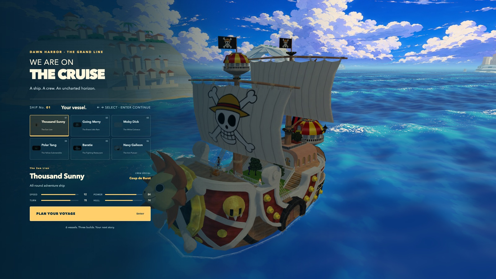 | Title and ship select share one static web-style panel. The ship thumbnails are dark and illegible. There is no music until the first click. |
| 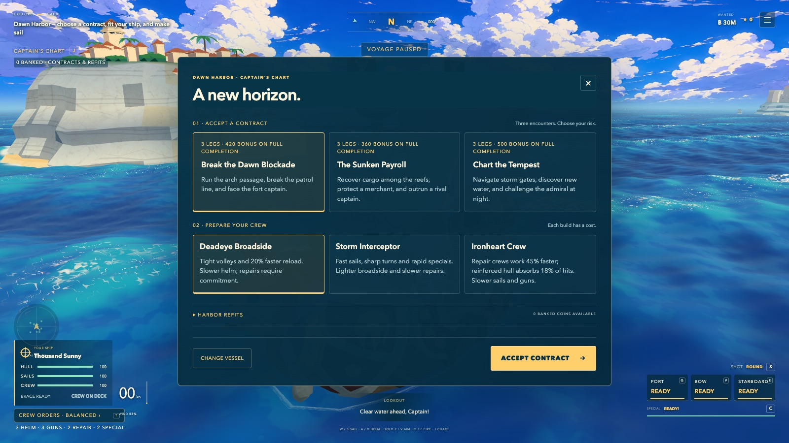 | The harbor is a SaaS-style modal full of prose over a frozen world. The harbor town is box houses with cone roofs. |
| 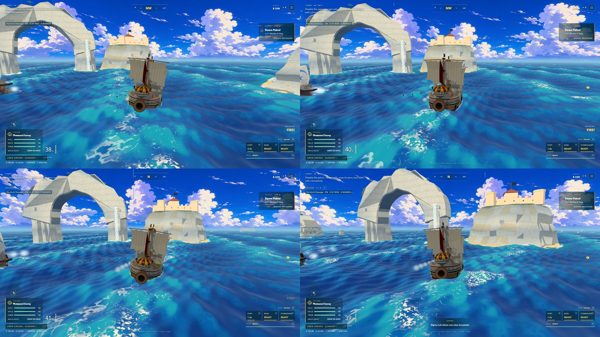 | A real battle from the chase camera. The enemy is mostly off-screen and cannonballs are dots. The islands are faceted grey blocks. |
| 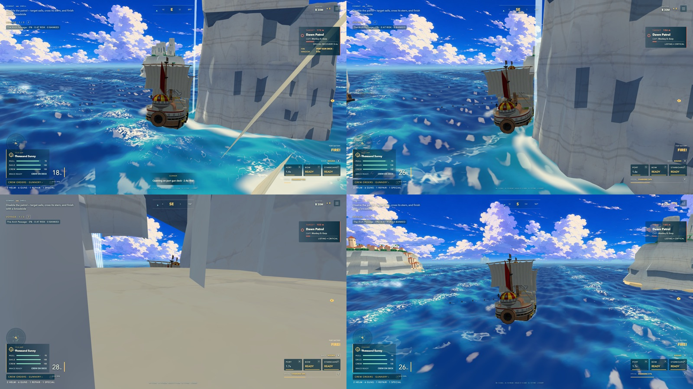 | The same fight: the camera enters cliff geometry, the ship grinds against the coast with no feedback, and foam is noise. |
| 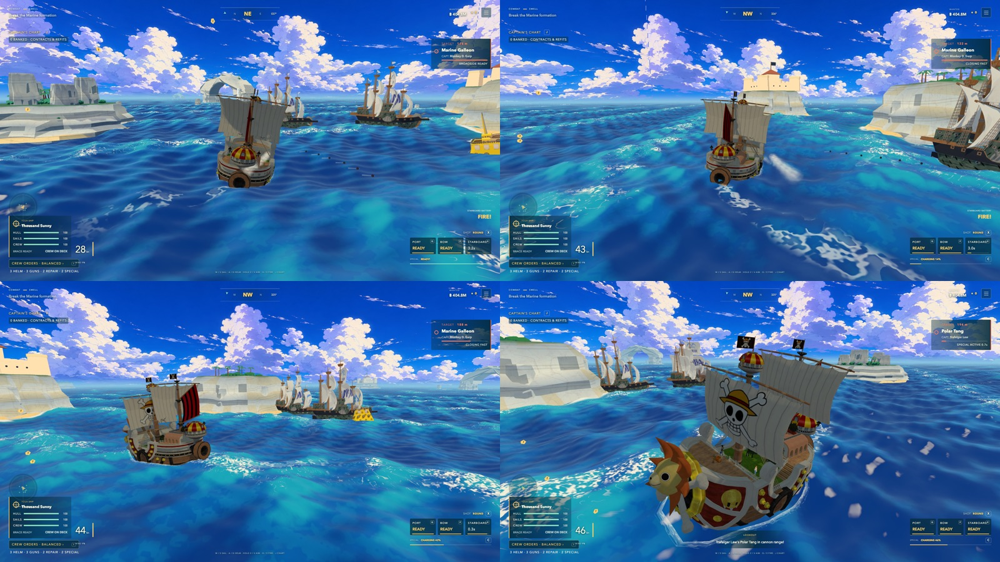 | Fleet battle: the Polar Tang fights for the Marines, because only six ship models exist. |
| 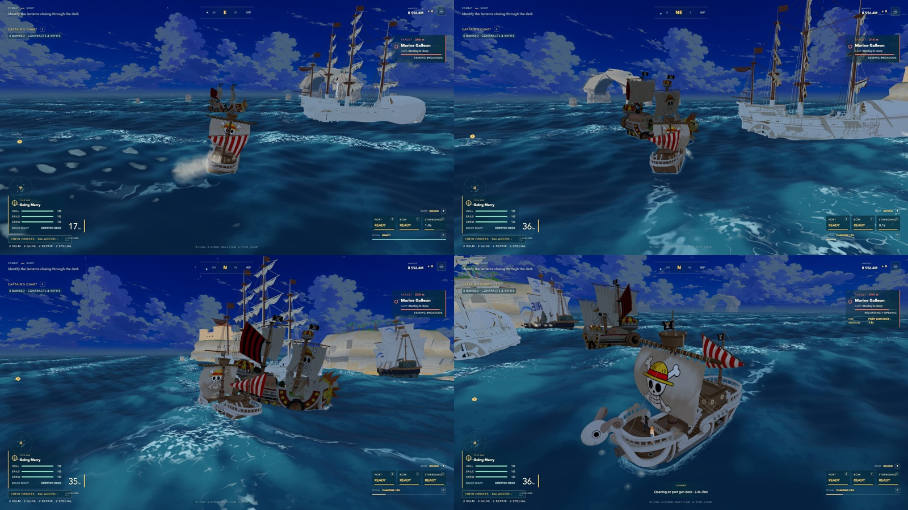 | "Night" is a dimmed day palette. Merry and Sunny clip through each other, and the Sunny is an *enemy*. |
| 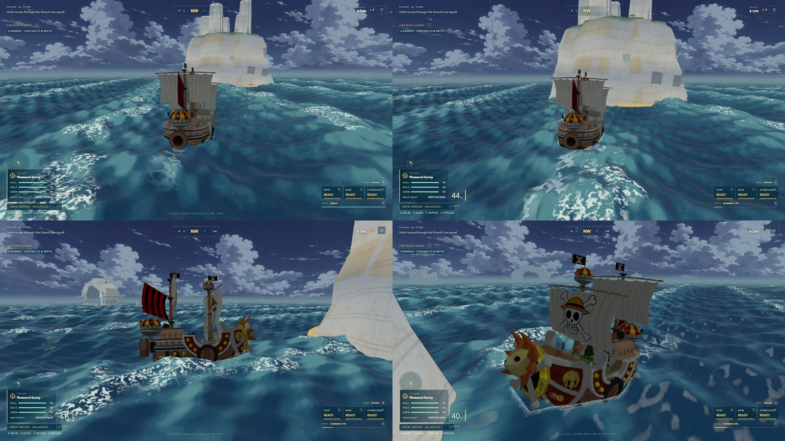 | The storm is a tinted day sky, a CSS rain overlay and teal water. |
| 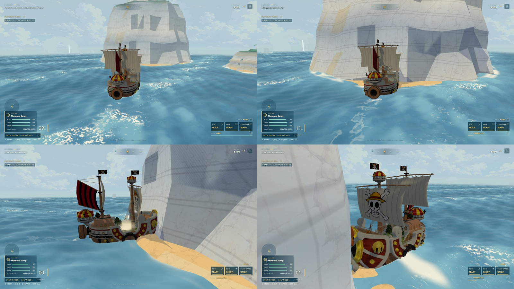 | Discovery in fog: the landmark is a flat-shaded block, and the ship stops dead against it. |

**Observations from play:**
- **No range feedback in the default view.** My scripted captain fired from 150–220 m, beyond round shot's ~136 m range, for 75 s and never finished the patrol. Nothing in the default view showed the shots were out of range; the fan only appears while holding Z/V.
- **Raw IDs reach the player.** The objective line printed "Discovered island:0:0:0" (`GameSimulation.ts:1836`).
- **Nonsensical speeds.** The speed readout reached 40–47 "kn".

**What to keep:**
- The fixed-step simulation and save discipline.
- The shared CPU/GPU wave contract.
- The encounter state machine.
- The evidence and gauntlet tooling.
- Ballistics/guide parity.
- The six ship silhouettes.
- The Moby pressure wave, which is the best effect in the game today.

---

## 3. North star

**Pitch.** A One Piece-inspired naval roguelite. You sail the Grand Line with your crew and fight Black Flag-grade ship battles that play out like an anime episode. You board your enemies, raise your bounty, and get further every voyage.

**Pillars.** Every feature has to serve at least one of these.
1. **Every broadside is a set piece.** Firing, hits and kills get anime-grade spectacle: shape-first FX, impact frames, camera language.
2. **The ship lives in your hands.** Weight, wind, waves and momentum; steering is a skill.
3. **Your crew are your powers.** Nakama abilities, boarding and station choices decide fights.
4. **Every voyage is a new story.** Branching seas, bounty, rivals and builds. Run five should feel different from run one.

**Quality references:**
- Assassin's Creed IV: naval feel and camera.
- Sea of Thieves: water and weather drama.
- Wind Waker HD / Genshin Impact / One Piece Odyssey: toon rendering.
- Hades / Slay the Spire / FTL: run structure and build variety.

**Scope strategy: AA scope, AAA polish.** This is a focused, deep naval game at top quality per square metre, not an open world. Browser-first, with desktop Chrome as the primary target. Mobile gets a dedicated tier later.

---

## 4. Art direction: "Grand Line Cel"

### 4.1 Target frames

Each target is a paint-over of a **real engine frame**: same camera, same downloaded ship. That makes every target a concrete to-do list for the renderer, not a fantasy concept. The previous concept frames were drawn from scratch; as a result, engine captures could never be compared with them one-to-one.

Left of each pair: engine today. Right: target. Full-resolution targets are in [`targets/`](targets/).

**T1: Hero sailing.** Same camera and ship; unified finish, bow wave, hull foam, V-wake, calm stylized sea.

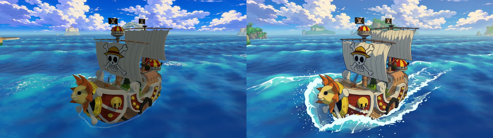

The engine needs:
- one cel ramp plus ink outlines (R1, R5);
- an ocean interaction target that drives the bow wave, contact foam and Kelvin wake (R8);
- ocean normal textures that fade with distance (R7);
- aerial perspective (R3);
- lush island art (R13).

**T2: World art.** Sandstone arch with waterfalls, Marine fortress, terraced port town, shore foam.

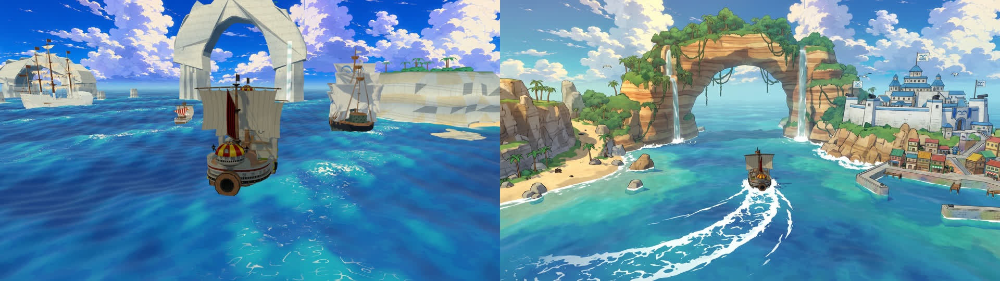

The engine needs:
- a coast and town kit (R13);
- a shore distance field for surf (R14);
- shallow-water colour;
- a curved wake from R8.

**T3: Broadside.** Staggered muzzle flashes, inked smoke, glowing shot trails, water columns, splinters, fire.

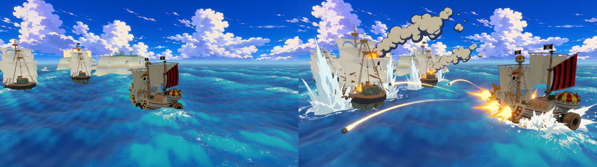

The engine needs:
- the FX kit (R9);
- HDR bloom (R4);
- ripple-fire timing, recoil heel and an FOV kick (R2, R10);
- damage visuals (R11).

**T4: Night.** Moon path, lanterns, searchlights, bioluminescent wake.

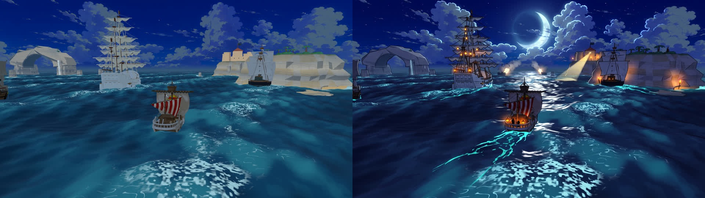

The engine needs:
- time of day with a moon and a moon path (R12);
- emissive lanterns with bloom (R4);
- fort searchlight cones;
- emissive foam in R8.

**T5: Storm.** Lightning, rain sheets, a wave bigger than the ship, god rays.

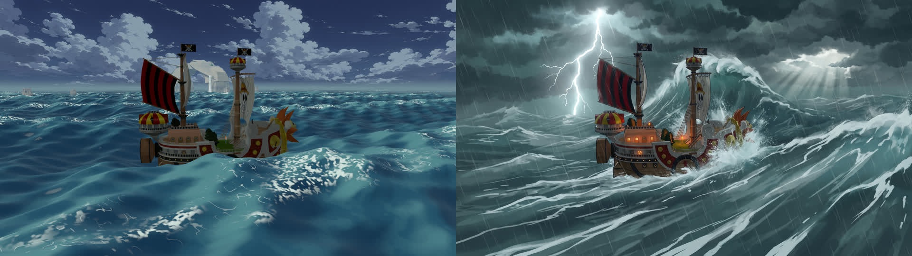

The engine needs:
- weather blending and a simulation-owned sea state (R12, G6);
- 3D rain and lightning;
- wind-torn spray;
- god rays in post.

**T6: Discovery.** A colossal landmark island emerging from mist.

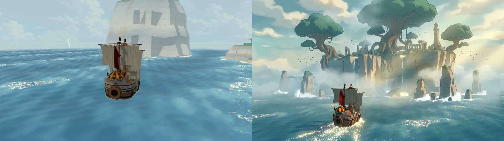

The engine needs:
- landmark island authoring (R13);
- height fog and fog-bank cards;
- sun shafts;
- a reveal camera and a music sting.

**T7: Combat HUD.** Ship ring, a firing wedge on the water, enemy nameplates, minimap, bounty chip, special gauge. The enemy names are placeholders.

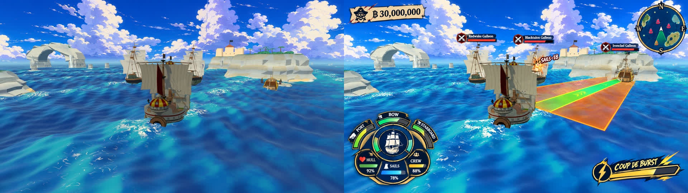

The HUD needs: UI-1 through UI-5 (section 7).

**T8: Front end.** Brush-lettered logo, wanted-poster ship cards, a living harbor, controller prompts.

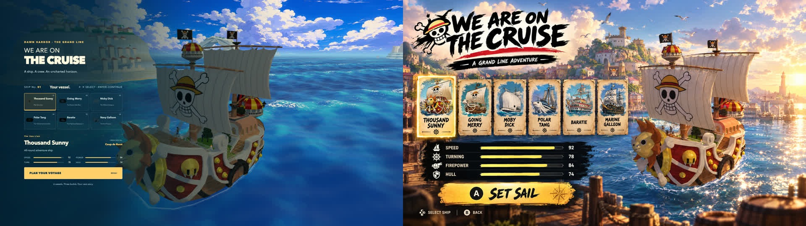

The front end needs: UI-6 and UI-7, plus a render clock so the world keeps moving behind menus.

**Feature concepts.** These use a real ship as reference; they are not camera-exact targets.

| T9 Sea King boss | T10 Special move (Coup de Burst) |
|---|---|
| 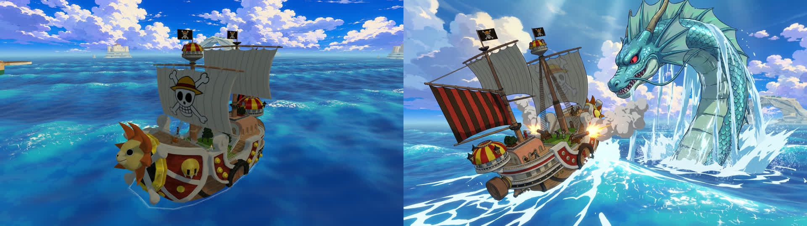 | 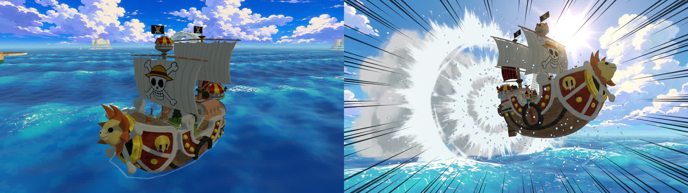 |
| **T11 Finishing blow and sinking** | **T12 Boarding (illustrative)** |
| 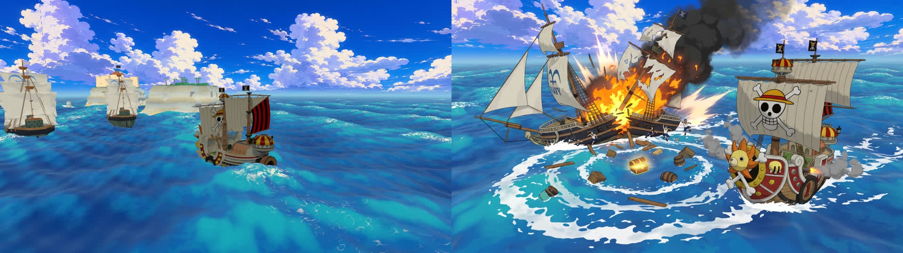 | 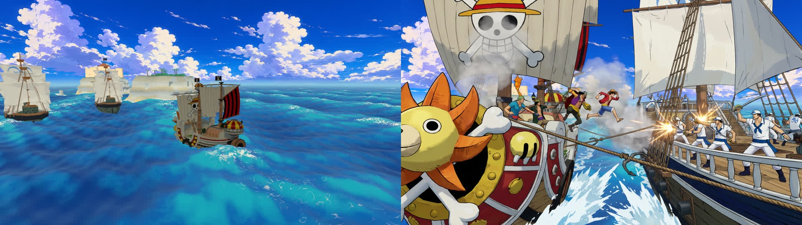 |

### 4.2 Style rules (the "bible")

**Shading**
- Two hard bands plus one soft core-shadow band, anti-aliased with `fwidth`. Ramps are defined per material family: wood, cloth, metal, skin, stone, foliage.
- Shadows are cool blue-violet, never grey. Sunlight is warm.
- Rim light appears on the lit side only, and is stronger on characters.
- No PBR specular. Brass and wet surfaces get hard-edged highlight shapes instead.
- Normal maps are capped at about 0.15 strength. Form comes from geometry and paint, not noise.

**Ink**
- Silhouettes use inverted-hull shells with a smoothed-normal attribute (so they don't crack at hard edges).
- Lines are 1.5–2.5 px at 1080p, thinning with distance. Ink colour is navy (#1b2340) and fades into fog.
- Interior lines (plank seams, panel lines, sail seams) are baked into albedo, with an even texel density across all ships.

**Colour script**
- Six grading LUTs: dawn gold, noon cobalt, golden-hour amber/violet, night indigo with lantern orange, storm teal-grey with lightning white, fog pearl.
- Aerial perspective starts at about 150 m.
- The foreground has the most contrast, and each shot gets one accent colour (for example muzzle orange).

**Water**
- Colour runs from deep cobalt to turquoise by view angle and depth, with teal shallows near coasts.
- Back-lit crests glow cyan.
- There are three foam families:
  1. Crest caps: strokes aligned with the wind.
  2. Contact and wake foam: driven by the interaction target.
  3. Shore foam: driven by the distance field.
- Foam shapes are rounded blobs plus lace lines, always white with a blue-grey shadow edge. **Never pixel noise, never shimmer at distance.**

**Sky**
- A painted gradient dome plus cel-lit cloud cards at three parallax depths.
- Sun and moon discs; god rays in post.
- Cloud colour tints the water.

**FX (the sakuga language)**
- Every effect starts from a designed silhouette: starburst, crown splash, mushroom smoke, spiral whirl, plank shards.
- Smoke is two or three cel tones with an ink edge, and erodes away instead of fading.
- Flash cores are additive and above 1.0 so they bloom, and last 2–4 frames.
- Timing follows anticipation → fast ease-out burst → a 0.2–0.4 s hang → settle or dissolve.
- Critical hits and finishing blows get a 1–2 frame impact frame. Fast motion gets speed lines and smears.

**Camera**
- In combat, the camera sits low (2–8 m above the water) and wide (55–65° FOV).
- The horizon leans with the ship's heel.
- Volleys get an FOV kick; specials and finishers get letterboxed cut-ins.
- The camera never enters geometry.

**UI**
- Brush-ink display type plus a clean sans-serif for numbers.
- Wanted-poster and manga-panel motifs; icons before words.
- At least 12 px at 1080p; every state change animates.

### 4.3 Rendering work list (in order)

Effort key: S = 1–2 days, M = 3–5 days, L = 6+ days. Code locations are in [rendering audit §8](audits/rendering.md#8-leverage-points).

| # | Work | Effort | Acceptance |
|---|---|---|---|
| R1 | **Bring outlines back.** Use smoothed-normal inverted hulls on ships, skinned crew and islands, fading into fog. The current outline code is never called. | S | Every silhouette is inked; no cracks at hard edges; no ink on the ocean |
| R2 | **Fix camera shake.** Apply it after damping, with roll. Add a volley FOV kick of +4–6° and a 2-frame flash on each hit-stop. | S | A heavy impact visibly jolts the frame; a shake setting of 0 still shows hits |
| R3 | **One fog curve with height fog** for ocean, islands, ships, outlines and FX. Density is set per weather. | S | Islands at 200–600 m separate into depth layers |
| R4 | **HDR target and post.** Use `outputBufferType: HalfFloatType` + `setEffects([bloom, LUT grade, vignette])`. Push glints, flashes and jets above 1.0. | S–M | Muzzle flashes and sun glints bloom; each weather has a LUT |
| R5 | **One cel ramp for ships and crew.** Remove the 0.38 unlit fill, add a cool shadow tint and rim light, cap normal maps, add a per-ship colour-levels table, move crew to `MeshToonMaterial`. | M | A six-ship contact sheet reads as one game (the critic's pass condition) |
| R6 | **Water-contact triage.** Delete the sphere bow spray. Make contact foam heavier at the bow, tucked under the hull. Sample 5–7 wave heights across the wake. Add Kelvin arms at ±19.5°. | M | No detached puffs; wake never pierced by crests |
| R7 | **Restyle the ocean.** Two wind-aligned normal textures with a distance fade; crest-following foam strokes; crest glow; a sky reflection tint; a camera-centred dense grid; a single sun uniform. | M | No shimmer in motion; swells readable from the chase camera |
| R8 | **Ocean interaction render target.** A top-down texture following the camera collects hull footprints, bow-wave height, wake, Kelvin, impact, sinking-whirl and Moby-front stamps. The ocean reads it for foam and visual-only displacement. | L | T1 water parity: a bow pile-up, side streaks and a tapering V; a critic scores contact ≥8/10 |
| R9 | **FX kit.** Blender-rendered toon flipbooks (smoke, splash crowns, fire); additive starbursts; instanced plank debris and sparks; splash columns; dissolve shaders; timing curves. | M | T3 parity for a volley |
| R10 | **Camera beats.** Low rail broadside camera, follow-the-volley camera, two-ship framing, 0.5 s slow-motion orbit on disable, letterboxed special cut-ins, camera collision. | M | The target is always framed; the camera never clips |
| R11 | **Damage visuals.** Breach and scorch decals at real impact points, flipbook fire, sail-tear masks from `damage.sails`, mast-break variants from Blender pre-splits. | M | The damage state is readable from any camera after the flash |
| R12 | **Sky, time of day and weather blends.** One shared sun state instead of four hard-coded vectors; 3–5 s crossfades; cloud cards; moon and stars; 3D rain and lightning; lanterns. | L | T4 and T5 parity |
| R13 | **World art kit.** Displaced cliffs with overhangs and strata; wet band; scattered rocks; vegetation; town and fort kit; landmark islands. | L | T2 and T6 parity |
| R14 | **Budgets and tiers.** Shared LOD textures plus KTX2; Navy low-LOD rebuild; atlas Sunny's 36 materials; player ship always at high LOD; shader precompile; GPU-timed tiers that can step back up; shore distance field. | M | Texture memory below 250 MB; 60 FPS on M4 with all of the above; a medium tier at ≥45 FPS on a mid laptop |
| R15 | (Later, optional) **WebGPU / TSL port** for compute particles and a GPU wake simulation. | L | Only after R1–R14; needs its own performance proof |

### 4.4 Signature spectacle moments

A trailer is made of these. Build each one as a complete beat covering gameplay, FX, camera, audio and UI.

1. **Broadside ripple.** Staggered flashes run down the hull, a wall of inked smoke drifts with the wind, water columns rise around the enemy and splinters fly. The camera gets an FOV kick and a heel lean. (T3)
2. **Coup de Burst.** A cut-in, a ring shockwave, airtime over the waves, speed lines, and a slow-motion landing splash that damages anything it lands on. (T10)
3. **Finishing blow.** An impact frame, the hull snaps into its pre-split pieces, the masts topple, sailors dive, foam whirls, and loot glows on the surface. (T11)
4. **Sea King breach.** A displacement stamp lifts the ship, water sheets pour off scales, then tail-slam and swallow attacks. (T9)
5. **Rogue wave.** A telegraphed swell rises; brace to punch through, or turn to surf it for a speed burst. (T5)
6. **Knock-Up Stream / waterspout.** A route event that launches the ship skyward to a secret node.
7. **Night battle.** Searchlights, lantern silhouettes, muzzle flashes lighting the smoke, a bioluminescent wake. (T4)
8. **Fort assault.** Cliff batteries fire mortar arcs. Destroy the guns one by one, then watch the walls crumble.
9. **Moby quake.** The screen cracks, the sea tilts, and a tidal front pushes every ship back.
10. **Island reveal.** Fog lifts, a music sting plays and a name card appears. (T6)
11. **Boarding clash.** Grapples fly, a crew charge, then a captain duel beat. (T12)
12. **New wanted poster.** At the end of a run the poster prints, the bounty counts up, and you can share the image.

---

## 5. Gameplay overhaul

Effort is shown in brackets. Code locations are in the [gameplay audit](audits/gameplay-systems.md).

### 5.1 Handling (G1)

- **Keel model.** Sideways drag should be about 10× forward drag; yaw and roll inertia should scale with mass, so the Merry feels snappy and the Moby ponderous; turning and wind should heel the ship. [M]
- **Sail gears, like AC4.** Stop, half sail (the tightest turn), full, and a boost (the ship's special or a wind gust). [S]
- **Points of sail.**
  - Speed depends on angle to the wind:
    - in irons: ~25%;
    - close-hauled: ~70%;
    - beam reach: 100%;
    - broad reach: ~110%.
  - Gusts, and wind that shifts per encounter.
  - A wind arrow on the minimap rim.
  - Wind currently never changes and always blows from the same angle. [M]
- **Waves as forces.** Surf down swells for speed, slam into oncoming waves (speed loss plus spray), and meet telegraphed rogue waves and whirlpools. [M]
- **Collisions.** Ship-shaped hull capsules with impulses. The rammer takes damage too, damage lands on the section actually hit, the mass ratio is capped, and ramming at full sail with a reinforced bow gets a bonus. [M]
- **Input.** Analog helm and sail on gamepad, plus camera-relative steering assist as an option. [S]

### 5.2 Combat sandbox (G2)

- **Camera-driven aiming (the AC4 standard).**
  - Look toward a side and hold aim (RMB/LT); a filled wedge shows spread and range and turns green on target.
  - Range sets elevation.
  - Release to fire a staggered volley.
  - This replaces the Z/V key choice, which blocks steering while held. [M]
- **Distinct ammo roles.** Explosive currently beats round shot on every stat. The rebalanced roles:
  - **Round:** all-rounder.
  - **Chain:** shreds sails, slowing and pinning the target.
  - **Heavy:** close-range hull and armour.
  - **Fire:** damage over time, and the crew panics.
  - **Grape:** kills crew, which sets up boarding. [S]
- **Arsenal slots, unlocked per ship over a run.**
  - Bow chasers: long range.
  - Stern mortar: targeted area reticle.
  - Fire barrels dropped astern.
  - Swivel guns: precision on weak points.
  - Ship-signature weapons, for example a charged beam cannon for the Sunny as an upgrade. [L]
- **Component damage.** Masts, rudder, gun decks and magazine, with fire and flooding that crew must fight. A disabled enemy should visibly list, burn and drift, not sit inert. [L]
- **Weak points.** Glowing magazine or rudder spots exposed by enemy manoeuvres, and swivel or sniper abilities to exploit them. [M]
- **Economy.**
  - Brace gets stamina.
  - Repairs consume planks from salvage.
  - Shot and powder are stocked per run.
  - This makes salvage choices matter. [M]

### 5.3 Enemies, AI and bosses (G3)

- **Roster of 12 classes for v1.0.**
  - **Marines:** sloop, brig, frigate/galleon, mortar ship, fire ship, battleship.
  - **Pirates:** three themed crews, each with a gimmick (for example submerged fish-man ambushers).
  - **Others:** bounty-hunter cutters, merchant convoys, one sea-monster family, fort batteries.
  - Every class has a readable silhouette and colour. Hero ships no longer stand in as enemies. [L, asset-bound]
- **AI v2.**
  - Lead that scales with skill; turning to bring the *loaded* side to bear.
  - Crossing the T and stern rakes; line-of-battle and pincer formations.
  - Focus fire, retreat and regroup, boarding attempts.
  - Using terrain and weather.
  - Difficulty that rises with heat.
  - Fix: the ranged role fires beyond its real reach. [L]
- **Bosses with phases, telegraphs and armour plates:**
  - a Vice-Admiral whose Buster-Call phase brings reinforcements and mortar carpets;
  - a Warlord whose fruit power adds fog, illusions or gravity;
  - a Sea King that breaches, slams and swallows;
  - a Yonko commander with a Haki shockwave that knocks crews out. [L each]
- **Encounters at their landmarks.** Random wind and approach, the simulation running between legs (no teleports), and real threats in salvage and storm legs. [M]

### 5.4 Crew powers and boarding: the One Piece heart (G4)

- **Nakama are your ability loadout.**
  - Each has a passive and an active ability with a cooldown, tied to a station (helm, guns, repair, lookout, galley).
  - Fan-build examples:
    - grapple-boarding from the captain;
    - cutting incoming cannonballs;
    - a wind-shift or lightning strike from the navigator;
    - weak-point sniping;
    - galley buffs;
    - crew healing;
    - holding enemy crews;
    - shipwright repairs;
    - a morale shanty;
    - helmsman current-riding.
  - This finally connects the ten anonymous hands to the named characters. [L]
- **Boarding.** Grapple is available when the target is slow (<6 m/s) and within ~30 m, then the fight resolves. Outcomes: capture (add to fleet or sell), plunder, recruit a crew member, or spare (affects bounty and infamy).
  - **Recommended first version:** a cinematic auto-resolve driven by crew stats and abilities, with 2–3 player choices during the fight. [M]
  - **Stretch:** a third-person captain brawler on deck. [L+]
- **Visible crew.** Station work animations (helm, hauling, loading, lookout, repair) on the shared 32-joint rig described in the asset audit, and crowds on every deck, including Navy and Polar. [M]

### 5.5 Ship identities (G5)

Each ship gets a handling profile, a weapon layout, a passive and a special. Today, three specials are one-off stat changes.

| Ship | Identity | Special (with visible wind-up, active and recovery phases) |
|---|---|---|
| Thousand Sunny | All-rounder, rich upgrade tree | Coup de Burst: airborne dash with a damaging landing; beam cannon as an upgrade |
| Going Merry | Nimble, fragile, lucky | "Miracle": once per run, survive a lethal hit, then a burst repair (repairs currently heal, not tack) |
| Moby Dick | Ponderous and massive; the 14-gun broadside becomes real (lift the 6-ball volley cap) | Quake: tidal front, knockback, cracked-screen beat |
| Polar Tang | Ambusher | Dive stealth plus torpedoes; a surfacing crit window. The ~3 s immunity becomes a designed rule |
| Baratie | Floating fortress; the side platforms are gun decks | Banquet: crew heal plus a temporary reload buff. The 34 m-wide collision is fixed to match the ~124 m model |
| Marine Galleon | Armour and firepower | Signal flare: mortar barrage on a marked area |

### 5.6 Weather as gameplay (G6)

- Move sea state and weather into the simulation. This also fixes buoyancy reading renderer-owned wave settings.
- **Fog and night** cut detection and aim range; lanterns and searchlights reveal ships.
- **Storms** bring gusts, rogue waves, and lightning that can set masts alight.
- **Maelstrom** (currently unused) pulls ships in.
- **Calm Belt:** no wind, Sea Kings.
- **Knock-Up Stream** as an event.

### 5.7 Feel checklist (the ten-second test)

Every combat action needs all of the following. Firing a volley today gets two of them.
- Anticipation.
- A readable effect.
- Camera response.
- An audio layer.
- A HUD confirmation.
- Where it applies: hit-stop, a damage number, crew bark and rumble.

---

## 6. Replayability: the Grand Line run

**Structure**
- A run is a voyage across **three seas**, each a branching chart of 8–10 nodes ending in a boss. That's 35–60 minutes per run.
- You can extract to bank at harbors. Losing forfeits unbanked spoils, which keeps the existing extraction rule.

**Node types**
- **Battle:** patrol, pirates or hunters.
- **Elite:** a named captain.
- **Convoy:** escort it or plunder it.
- **Storm crossing.**
- **Salvage** with a threat.
- **Island event:** an illustrated choice.
- **Harbor:** shipwright, market, recruit, repair.
- **Mystery:** a ghost ship, or a waterspout to a sky node.
- **Boss.**
- The Log Pose shows partial information: forecast, threat and reward.

**Build variety**
- Nakama (ability loadout).
- Ship parts: hull plating, sails, cannons, figurehead.
- Ammo mods.
- **Treasures** (relics with synergies, e.g. fire ammo + sniper = incendiary weak-point shots).
- Cursed items with drawbacks.

**Bounty and heat**
- Bounty persists across runs and becomes your profile, shown as a Wanted poster.
- Higher bounty raises Marine response: heat levels in the style of Hades' pact, with better rewards.
- Today, bounty resets every voyage.

**Nemesis captains**
- Named rivals persist across runs with scars, grudges and upgrades, returning stronger after each escape.
- This replaces the single rival counter.

**Meta progression**
- Unlock ships, nakama, starting treasures, harbor upgrades and cosmetics (sails, flags, figureheads).
- A Captain's Log compendium.
- **Daily seeded voyage with a leaderboard**, scored by bounty.

**Content targets for v1.0**

| Content | Target |
|---|---|
| Seas / biomes | 3 |
| Bosses / elites | 3 / 6 |
| Enemy classes / factions | 12 / 4 |
| Events | 40 |
| Treasures and parts | 60 |
| Nakama | 10 |
| Weather types | 5 |
| Ship specials | 6, with 3 upgrade tiers each |

---

## 7. UI, UX and audio

**UI.** Code locations are in the [UI audit](audits/ui-audio-feel.md).
- **UI-1, ship ring:** hull, sails and crew, three battery arcs and a special gauge in one widget (T7). [M]
- **UI-2, world overlay:** enemy nameplates with health and intent, incoming-fire marks on the water, and the aim wedge from G2. [M]
- **UI-3, feedback layer:**
  - hit markers and damage numbers on the target, directional damage;
  - fix the `just-fired` vs `is-firing` CSS mismatch;
  - fix the hit-confirm restart;
  - stop labelling every heavy hit "CRITICAL". [S–M]
- **UI-4, declutter:**
  - hide the economy, crew text, chart button and key legend during combat;
  - replace the legend with contextual prompts;
  - 12 px minimum, a licensed display font and a UI font. [M]
- **UI-5, special cut-in:** portrait, name call, speed lines, ~0.5 s slow-motion. Emit the charge and ready events, which are currently declared but never sent. [M]
- **UI-6, living front end (T8):**
  - a render clock keeps sea, sky and idle motion running behind every menu;
  - brush logo, title theme, wanted-poster ship cards with stats generated from specs;
  - the harbor as a map table. [M]
- **UI-7, cold-open onboarding:** a scripted ~90-second escape from a Marine patrol at dawn that teaches sail, steer, aim, fire and brace, then reveals the harbor and the title. [L]
- **UI-8, input and accessibility:**
  - gamepad menu navigation, right-stick camera, analog helm, rumble;
  - full remapping including aim, hold or toggle;
  - fix the bug where reduced motion (or a shake setting of 0) hides combat feedback;
  - colour-blind-safe status colours, HUD scale, volume sliders, in-game quality settings. [M]

**Audio**
- **A-1, sourced score:**
  - orchestral plus shanty/folk (fiddle, concertina, bodhrán, a brass hero theme) as stems;
  - states: title, harbor, explore, tension, combat low/high, boss, special sting, low hull, victory, defeat, extraction, storm;
  - transitions land on bar lines. [L]
- **A-2, SFX library:**
  - cannon near and far layers with tails, fly-by whistle;
  - wood impact and splinter, sail tear, mast fall, sinking groans, fire, splash layers;
  - bow wash and hull slap synced to the waves; a harbor ambience bed. [M]
- **A-3, crew voice:** barks for fire, brace, reload, hit and kill, plus sung shanties while sailing (AC4's signature), all routed through a priority queue. [M]
- **A-4, mix:**
  - listener-relative spatial audio (HRTF panner with distance falloff);
  - fix panning by the firing ship's side;
  - ducking and voice limits;
  - a saved mute setting. [M]
- Keep the synth only as a fallback.

---

## 8. Assets and tools pipeline

**Current reality**
- 241 local source files, but 205 are characters.
- The 24 unused ship files are mostly duplicate Merrys and Sunnys.
- No props, islands, enemy fleets or sea monsters.
- **Three of the four in-game characters show indicators of extraction from Bandai Namco games** (Luffy, Nami, Whitebeard; evidence in [assets audit §3](audits/assets-and-licensing.md#3-licensing-reality-check)). **Replace them first.**
- The Marine source has named cannon bones, which give real gun positions.
- The previous direction stands: the six named ships remain the downloaded models, and no generated replacement hulls are used.

| Asset class | Source | Pipeline | Budget |
|---|---|---|---|
| Hero ships (6) | Downloaded models (keep) | **Blender MCP "cel prep":** de-lit albedo, AO and curvature on UV2, smoothed-normal attribute, cannon sockets (Marine bones plus measured positions), sail bones, pre-split damage pieces, collision proxies (Baratie), shared-texture LODs, KTX2 plus Meshopt | ≤80k tris high / ≤20k low; ≤16 materials; ≤2048² atlas |
| Enemy fleet (12 classes) | Sketchfab CC-BY first, with provenance checked | Blender kitbash on 2–3 hull bases, cel prep. **Generated hulls only with your approval** (see decision 2) | ≤25k tris; shared trim sheets |
| Hero crew | D7Xtreme family (one shared 32-joint rig) plus the clean Mixamo Luffy (3d9fb8bd) | Replace the flagged three; author station work animations once in Blender and share them | ≤6k tris each |
| Generic crews (Marines, pirates) | Meshy text-to-3D (humanoid) → Meshy rig and animate; Quaternius CC0 as a fallback | Decimate, recolour per faction, instanced crowds | ≤3k tris, GPU-skinned |
| World kit (cliffs, arches, rocks, ruins, docks, town, fort, vegetation) | Meshy image-to-3D from Higgsfield concept sheets; Poly Haven, Kenney and Quaternius CC0 | Blender: decimate (Meshy output is ~1.9M tris), UV, cel bake, geometry-nodes cliffs, modular snapping | Per-island ≤150k tris, 1–2 trim atlases |
| Sea monsters | Higgsfield concept (T9) → Meshy multi-image-to-3D | Blender: decimate to ~30k, spine-chain rig, decal repaint; procedural animation in engine | ≤40k tris |
| FX flipbooks | Blender | Toon-shaded smoke and splash simulations rendered to sprite sheets; shape-based shader FX | ≤4 sheets at 2048² |
| Sky and grade | Higgsfield | Painted cloud cards (with background removal), gradient domes; LUTs colour-matched to the targets | — |
| UI art | Higgsfield for posters, ship-card art and logo exploration; Figma for layout | Export to atlas / SVG | — |
| Audio | CC0/CC-BY libraries or a commission; Higgsfield TTS for generic crew barks (speech only; it cannot make music; never imitate anime voice actors) | Loudness-normalized and hash-ledgered | — |
| Marketing | Higgsfield video for trailer B-roll; in-engine capture for gameplay | Generated footage never goes into `public/` or gets presented as gameplay | — |

**Credit budget as of today**
- **Higgsfield:** 183 credits before this pass, about 26 spent on the 12 targets, leaving ~157. That covers roughly 55–75 more 2K frames.
- **Meshy:** 1,285 credits, for example:
  - ~20 props at 20 credits;
  - ~10 textured kit pieces at 30;
  - ~6 generic crew including rig and animation (~30 each);
  - one creature at 35.
  - That comes to ≈1,100.
- Every Meshy spend is confirmed with you first.

**Sourcing hygiene**
- Resume Sketchfab only after a paced 429 check, and only for:
  - the shortlist in the asset audit (Law, the D7Xtreme crew, Wavers, Jinbe, barrels);
  - targeted searches for Red Force, Oro Jackson, generic galleons and sloops.
- Before integrating anything from uploaders whose files show extraction indicators, check provenance.

---

## 9. Technical foundation (build before scaling content)

| # | Work | Why | Effort |
|---|---|---|---|
| F1 | Pin `three` to 0.185.1 (currently `latest`) | Reproducible renders and receipts | S |
| F2 | Split `GameSimulation.ts` into systems over one entity store with id lookup: sailing, weapons, damage, AI planning and steering, specials, encounter director, persistence | Boarding, fleets and new weapons are impractical inside the monolith | L |
| F3 | Data tables for ships, weapons, ammo, specials, enemies, crew abilities, treasures | A new ship currently touches ~8 files; enables an IP-agnostic "skin" layer | M |
| F4 | Save v2 with migrations; raise the 20-ship / 256-projectile / 10-crew limits; stop saving internal slot layouts | Needed for fleets and meta progression; v1 is locked | M |
| F5 | Move sea state and weather into the simulation; test buoyancy on the real waves | The simulation currently depends on renderer-owned wave settings | M |
| F6 | A render clock separate from the simulation clock | A living world behind menus, and slow-motion that doesn't break saves | S |
| F7 | Split `Hud.ts` into components with a typed view model and one world-projection pass | 2,190-line class; DOM rewrites every frame | M |
| F8 | Shared LOD textures, KTX2, player ship always at high LOD, shader precompile | ~806 MB worst-case texture memory; hitches on first view | M |
| F9 | GPU-timed quality tiers, selectable in-game | DPR currently only ever steps down | M |
| F10 | **Target-parity harness:** camera bookmarks that re-capture the same plates each milestone and place them beside T1–T8 | Makes art progress measurable and ends score-chasing | S |

Evidence discipline stays as it is: engine frames and generated targets live in separate folders; the FPS claim needs a sustained real-RAF profile; every browser is closed after use.

---

## 10. Roadmap

The estimates assume one lead plus agent fan-out, as in recent sessions. They are scope-dependent and meant for ordering work, not for promising dates.

**Phase 0: foundations and quick wins (~1 week)**
- The [bug list below](#12-appendix-quick-win-bug-list).
- F1, F6, R1, R2, R3.
- Replace the three flagged characters.
- Remove the sphere bow spray.
- Fix the player Baratie LOD.
- Persist bounty.

**Acceptance:**
- 163+ tests pass.
- The 12 plates re-captured, showing ink outlines and visible shake.
- 60 FPS held.

**Phase 1: "One Perfect Battle" vertical slice (~4–5 weeks)**

Everything else scales from this slice.
- **Scenario:** The Arch Passage at golden hour. The Sunny against a Marine patrol (galleon plus two new classes) and a cliff fort battery.
- **Ending:** a finishing blow, a boarding beat and the bounty poster.
- **Work included:**
  - rendering: R4–R11 plus the R13 arch/fort/town slice;
  - gameplay: G1, camera-driven aiming, and ammo roles plus mortar and fire barrels from G2; AI v2 lead, loaded side and formations from G3;
  - UI: UI-1 to UI-5;
  - audio: A-1 to A-4 for this slice;
  - assets: cel prep for the Sunny and the Marine galleon; a deck crowd.

**Acceptance:**
- Side by side with T1/T2/T3/T7/T11.
- A fresh blind critic scores ≥8/10 on stills **and** on a 3-minute real-time capture.
- 60 FPS on the M4 at 1600×900; ≥45 FPS on a mid laptop at the medium tier.
- In a five-player playtest, players can explain why they won or lost and ask to play again.

**Phase 2: combat depth and crew (~5–6 weeks)**
- Boarding (G4, first version) and 6–10 nakama abilities.
- Eight or more enemy classes; Vice-Admiral and Sea King bosses; fort assault.
- Component damage, fire and flooding.
- Weather as gameplay: fog, night, storm, rogue waves.
- All six ships cel-prepped with redesigned specials; crews on the Navy and Polar.

**Acceptance:**
- Each ship and boss has a distinct counterplay.
- Median fight length is 60–180 s.
- Playtesters rate combat ≥8/10.

**Phase 3: the Grand Line run (~5–6 weeks)**
- F2 through F4 completed.
- The sea chart with all node types; the harbor hub; 30+ events; 40+ treasures and parts.
- Heat and bounty; nemesis captains; meta unlocks; the daily voyage.

**Acceptance:**
- Median session ≥40 minutes.
- ≥60% of testers start a second run.
- A novelty checklist for the fifth run passes.

**Phase 4: world, weather and 1.0 polish (~6–8 weeks)**
- R12 plus R13 at full scale: three seas, landmark islands, day/night, storms, discovery reveals.
- The cold-open onboarding.
- Front-end spectacle.
- Accessibility.
- A mobile tier and controller parity.
- A trailer made from in-engine capture.

**Acceptance:**
- Parity with all 12 targets.
- A device matrix.
- Long-session stability.

---

## 11. Decisions needed from you

1. **IP path.** Keep the One Piece fan build (non-commercial, provenance cleaned up, accepting that rights holders could still object)? Or plan an original "inspired by" universe, which any commercial or Steam release would require?
   - *Recommendation:* stay a fan build for now, as you directed. F3 makes ships, crews and factions data-driven skins, so an original skin could drop in later. Decide before Phase 3 content production.
2. **New enemy ship classes.** You rejected generated *replacement* ships. May new enemy classes (not the six named ships) be built in Blender or generated with Meshy when Sketchfab has nothing suitable? Without that, enemy variety stays capped by what exists on Sketchfab.
3. **Boarding depth.** A cinematic auto-resolve with choices first (recommended), or go straight to a third-person captain brawler?
4. **Platforms.** Desktop Chrome first and mobile as a later tier (recommended), or mobile parity from Phase 1?
5. **Audio.** CC-licensed sourcing now (recommended), or budget for a commissioned score and shanties?

---

## 12. Appendix: quick-win bug list

| # | Bug | Where |
|---|---|---|
| 1 | Ink outlines never render: `shipPresentation.ts` is imported nowhere; `CelEdgeComposer` is never constructed | `src/runtime/GameApp.ts:53,280` |
| 2 | Camera shake is added before damping, so ~6% reaches the screen | `src/render/camera/CameraRig.ts:191-198` |
| 3 | Weapon fire/reload pulses never play: TS adds `just-fired`/`just-reloaded`, CSS defines `is-firing`/`is-ready-flash` | `src/ui/Hud.ts:1973,2055`; `src/styles.css:756-761` |
| 4 | Hit confirms can't restart while visible | `Hud.ts:2137-2141`; `styles.css:1066,1092,1116` |
| 5 | Every heavy-shot hit is labelled "CRITICAL HIT!" | `src/runtime/eventAdapter.ts:21`; `Hud.ts:1993` |
| 6 | Shake 0 or OS reduced motion hides all combat banners and confirms | `Hud.ts:1351-1353`; `styles.css:2354-2365` |
| 7 | Extracting after beating the boss counts as an escape and forfeits the payout | `src/simulation/GameSimulation.ts:497,501-504,524-525` |
| 8 | The leg-3 upgrade pick is discarded | `GameSimulation.ts:397-399` |
| 9 | Enemies go passive after the objective and can be farmed | `GameSimulation.ts:573-580,879` |
| 10 | A player sailing the Baratie never gets an aim target (merchant faction) | `src/render/camera/AimGuide.ts:22-25`; `src/simulation/factions.ts:36` |
| 11 | The player's own Baratie shows its low LOD, and Sanji disappears with it | `src/render/ships/ShipGeometryFactory.ts:415` |
| 12 | Bounty resets at every voyage and harbor visit | `GameSimulation.ts:286,304` |
| 13 | Ramming: the rammer is immune and the target's bow always takes the damage | `GameSimulation.ts:1743-1751` |
| 14 | The AI never leads; the ranged role fires beyond its real reach | `GameSimulation.ts:1473,1115-1126` |
| 15 | Volleys are capped at 6 balls, even for the 14-gun Moby | `src/simulation/ballistics.ts:11-15` |
| 16 | Explosive strictly beats round shot | `GameSimulation.ts:147-157` |
| 17 | Volleys are panned by the firing ship's side, not by position relative to the listener | `src/audio/AudioDirector.ts:354,947-951` |
| 18 | Raw ids in player text ("Discovered island:0:0:0") | `GameSimulation.ts:1836` |
| 19 | Ship-card stats are hand-typed and contradict specs (Polar hull 66 vs 160) | `Hud.ts:113,168`; `src/content/shipSpecs.ts:56,101` |
| 20 | Adaptive DPR never steps back up on 60 Hz displays | `src/render/app/RendererHost.ts:109-123` |
| 21 | Every LOD file carries its own copy of the textures | `src/render/loaders/SketchfabShipAssets.ts` |
| 22 | `three` is unpinned (`latest`) | `package.json` |
| 23 | No camera collision: the camera enters cliffs | `CameraRig.ts` (observed in play) |
| 24 | The Baratie's collision is 34 m wide against a ~124 m model | `shipSpecs.ts:117` |

## Evidence index

- `current/`: unedited engine frames and contact sheets (2026-09-23 real-time play).
- `targets/` and `compare/`: generated paint-over targets and before/after pairs; [provenance manifest](targets/manifest.json).
- `audits/`: the four code audits with file:line evidence.
- Raw captures, the 85 s gameplay video and all 46 plates: `output/aaa-audit-2026-09-23/` (gitignored, on this machine only).
